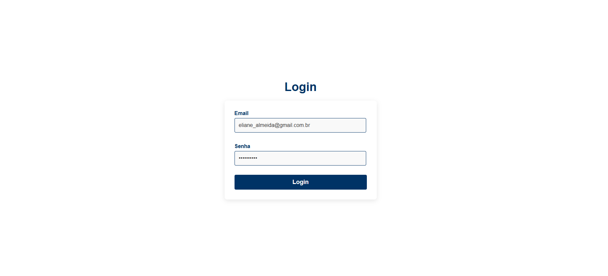
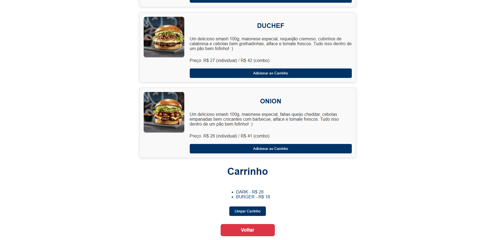
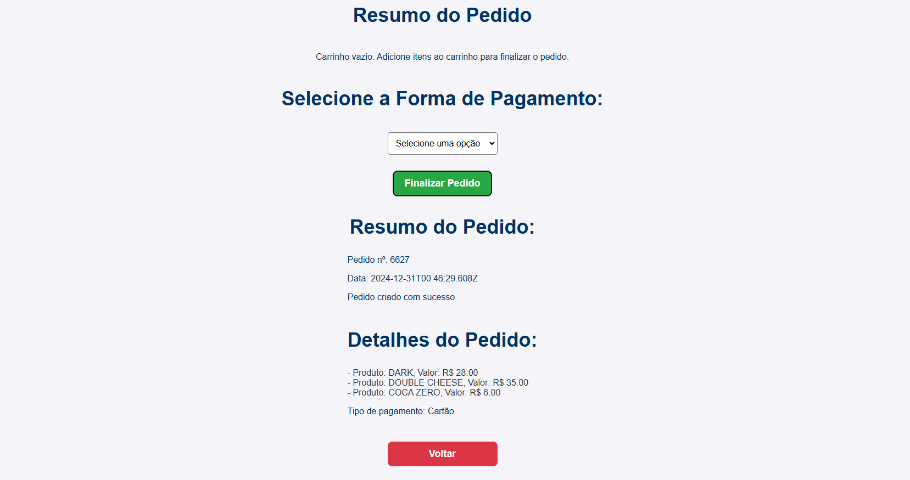

# Projeto de pedidos - FIAP

Projeto desenvolvido para ser entregue na disciplina de FrontEnd da MBA de Engenharia de Software na FIAP

Foi utilizado camadas para separação de responsabilidades visando um crescimento ordenado da aplicação. Baseado na abordagem do livro Clean Architecture, visando criar um arquitetura para projetos frontend.

## Tecnologias

Projeto utiliza [Vue.js](https://vuejs.org/) + [Typescript](https://www.typescriptlang.org/), projeto iniciado utilizando [Vite](https://vite.dev/)

## Time

Time envolvido em seu desenvolvimento:

- Gustavo Azevedo / RM: 353174
- Jacqueline Ito / RM: 354737
- João Claudio Lima / RM: 354858
- William Camargo / RM: 353146

Serviços obtidos a partir [Burgerlivery API](https://github.com/ubirajarapelli/burgerlivery-api)

## Telas do projeto em execução

Tela de Login


Tela de Pedidos Dispníveis


Tela Item Selecionado


Tela Pedidos Limpar Carrinho


Tela Finalizacao Pedido


## Configuração, Instalação e Servindo o projeto localmente

### Pré requisitos

Você precisa ter o [NodeJs](https://nodejs.org) instalado em sua máquina, na versão minima `v20`. Utilize seu gerenciador de pacotes preferido.

### Instalando o projeto

#### Clone o projeto

No terminal rode os comandos

```bash
git clone git@github.com:william-camasil/fiap_front_end_project.git
```

E acesse o diretório do projeto

```bash
cd fiap_front_end_project
```

#### Instale as dependencias

No terminal rode o comando

```bash
npm install
```

#### Servindo o projeto localmente

No terminal rode o comando

```bash
npm run dev
```
